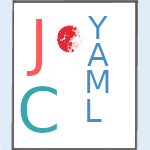

<h1 align="left">
⚙️ CJYaml — Ultra-fast YAML Parser for C & Java

</h1>

CJYaml is a **high-performance YAML 1.2.2 parser** written entirely in **C** for maximum speed and efficiency.  
The native library is seamlessly integrated with **Java** through a lightweight JNI bridge, allowing developers to work with YAML files faster than ever before.

---

## 🚀 Features

- 🔥 **Native speed** — all parsing logic implemented in C  
- 🧩 **JNI integration** — easy to call from Java with zero overhead  
- 🛠️ **Cross-platform** — builds cleanly on Linux, Windows, and macOS  
- 📦 **Simple build system** — powered by CMake + Maven  
- 🧼 **Self-contained** — no external runtime dependencies  

---

## 🧰 Building the Project

### 🐧 Linux / macOS

```bash
./build.sh
````

**Output:**

* CMake build directory → `build/`
* Compiled library → `out/linux/libcjyaml.so`
* Copied to → `src/main/resources/`
* Final JAR → `target/*.jar`

#### Options

```bash
./build.sh --clean       # Remove build/ and out/ before building
./build.sh --jobs 8      # Use 8 parallel jobs for compilation
```

---

### 🪟 Windows (CMD or PowerShell)

```cmd
build.ps1
```

**Output:**

* CMake build directory → `build\`
* Compiled library → `out\windows\cjyaml.dll`
* Copied to → `src\main\resources\`
* Final JAR → `target\*.jar`

> 💡 You can set `JAVA_WINDOWS_HOME` if JNI headers are not automatically detected.

---

## 🧹 Cleaning Up

```bash
./build.sh --clean
```

Removes all build directories and artifacts.


---

## 🧩 Architecture Overview

```
┌────────────────────┐
│      Java API      │
│  (CJYaml Wrapper)  │
└─────────┬──────────┘
          │ JNI Bridge
┌─────────▼──────────┐
│       libcjyaml    │
│    (C YAML Core)   │
└────────────────────┘
```

* The **C layer** handles parsing, validation, and structure management.
* The **Java layer** provides an intuitive object-oriented API.
* Communication between them is done through **JNI**, without serialization overhead.

---

## ⚖️ License & Credits

**License:** Apache 2.0
Copyright © 2025
Developed by [ScaleRock](https://github.com/ScaleRock)

### Third-party Components

This project includes the [xxHash](https://github.com/Cyan4973/xxHash) library:

* **Author:** Yann Collet
* **License:** BSD 2-Clause
* **Copyright:** © 2012–2021 Yann Collet

---

> 🧩 *CJYaml — bridging the power of C with the simplicity of Java.*


